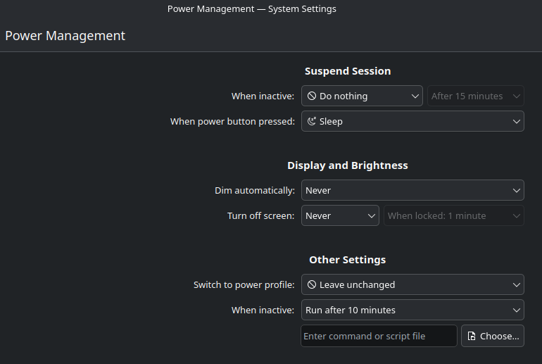
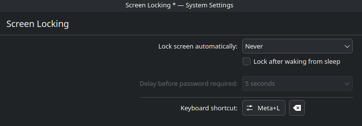

# TV Client Manual Configurations

Current required manual configurations for VHS TV clients. These could be baked into a base image or added to the vhs-client.sh configuration script in the future.

## Required Packages

The VHS TV Client should have:

- `openssh-server`
- `mpv`
- `inotify-tools`
- `socat`
- `libappindicator3-1`
- `Dropbox` app
- `dropboxd` daemon

Those are the tools the VHS stack depends on.

## KDE Plasma Desktop Settings

### Power Management

### Screen Lock

## TV-01 Config Checklist

- [x] OS Installation Settings
  - [x] Do not require password to log in
  - [x] Minimal installer
  - [x] Install available firmware updates `fwupdmgr get-upgrades`
- [x] System Settings
  - [x] Power Management (disable idle suspend, screen dim/power off)
    - [x] Power button = sleep
  - [x] Screen Lock = never
  - [x] Dark mode
  - [x] Colors: red accent
  - [x] Cursors: breeze light
  - [x] Switch dynamic wallpapers: based on plasma style
  - [x] Software Update = manual, never, after rebooting
- [x] Install baseline packages
  - [x] openssh-server, inotify-tools, mpv, libappindicator3-1
  - [x] run `apt autoremove` to remove unnecessary packages
  - [x] Delete the `/etc/mpv/mpv.conf` file to simplify mpv to one config file
  - [x] Dropbox
    - [x] Desktop app
    - [x] Daemon
      - [x] Run `~/.dropbox/dropboxd` and link account
      - [x] Confirm System Settings > Autostart > Dropbox = running. Restart may be requried.
      - [x] Preferences > Selective Sync > remove all except current TV client folder > Update
- [x] Install VHS
  - [x] ssh into client
  - [x] Run `sudo loginctl enable-linger`
  - [x] Create script `nano ~/vhs-client.sh`
  - [x] Paste contents
  - [x] Set permissions `chmod +x ~/vhs-client.sh`
  - [x] Run installer
- [x] Test
  - [x] Change contents of the TV's media folder on Dropbox and verify mpv updates on the client
  - [x] Close MPV to confirm it will restart itself after a crash
  - [x] Power button "sleep"
  - [x] Reboot
  - [x] Check mpv-kiosk.service logs for errors
- [x] Tailscale & Tailscale SSH
  - [x] Install and test
- [x] Add Backline Wi-Fi Connection

## TV-02 Config Checklist

- [x] Desktop Settings
  - [x] Power Management (disable suspend, screen dim/power off)
    - [x] Power button = sleep
  - [x] Screen Lock = never
  - [x] Dark mode
  - [x] Colors: red accent
  - [x] Cursors: breeze light
  - [x] Switch dynamic wallpapers: based on plasma style
- [x] System Settings
  - [x] Software Update = manual, never, after rebooting
  - [x] Screen Locking = never
  - [x] Run `sudo loginctl enable-linger`
- [x] Install baseline packages
  - [x] openssh-server, inotify-tools, mpv, libappindicator3-1
    - [x] run `apt autoremove` to remove unnecessary packages
  - [x] Delete the `/etc/mpv/mpv.conf` file to simplify mpv to one config file
  - [x] Dropbox
    - [x] Desktop
    - [x] Headless
      - [x] Run `~/.dropbox/dropboxd` and link account
      - [x] Confirm System Settings > Autostart > Dropbox = running. Restart may be requried.
      - [x] Preferences > Selective Sync > remove all except current TV node folder > Update
- [x] Install VHS
  - [x] ssh into node
  - [x] Create script `nano ~/vhs-node.sh`
  - [x] Paste contents
  - [x] Set permissions `chmod +x ~/vhs-node.sh`
  - [x] Run installer and test
    - [x] Change contents of the TV's media folder on Dropbox and verify mpv updates on the node
- [ ] Tailscale & Tailscale SSH
  - [ ] Install and test
- [ ] Add Backline Wi-Fi Connection

## How to prepare Dropbox on the golden image

Follow the steps in this article to avoid any unexpected issues when cloning an OS image with Dropbox installed.

Before making an image of the OS, remove the user specific Dropbox files. This forces Dropbox to create unique keys and instance data for each user on the cloned machines.

1. [Download the Dropbox installer](https://help.dropbox.com/installs/download-dropbox) on the golden image.
2. Follow the steps to install Dropbox, but don’t sign in when prompted.
   1. Installer
      1. ~/dropbox_2026.05.06_amd64.deb
3. Click the [Dropbox logo in the menu bar](https://help.dropbox.com/installs/system-tray-menu-bar?fallback=true).
4. Click your avatar (profile photo or initials) in the bottom-left corner.
5. Click **Quit Dropbox**.
6. Delete the “-/.dropbox” hidden folder from your home directory.
    - **Note**: Don’t run Dropbox again before the imaging or snapshot process. This recreates the .dropbox folder.
7. Remove any specific-system identifying information such as the UUID, static IP addresses, etc.  to finalize the installation before cloning.
8. Shut down the workstation and create the golden image.

When a user starts the Dropbox app on a cloned machine, the Dropbox user directory is automatically recreated for that individual user.
